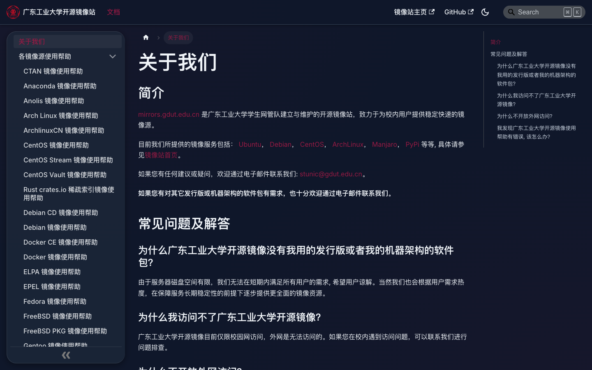
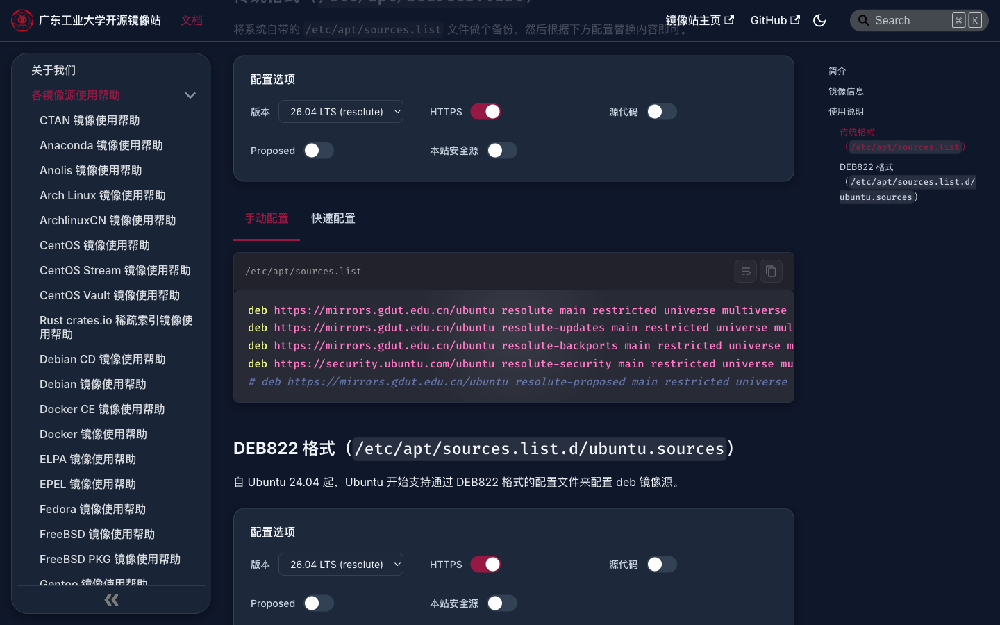
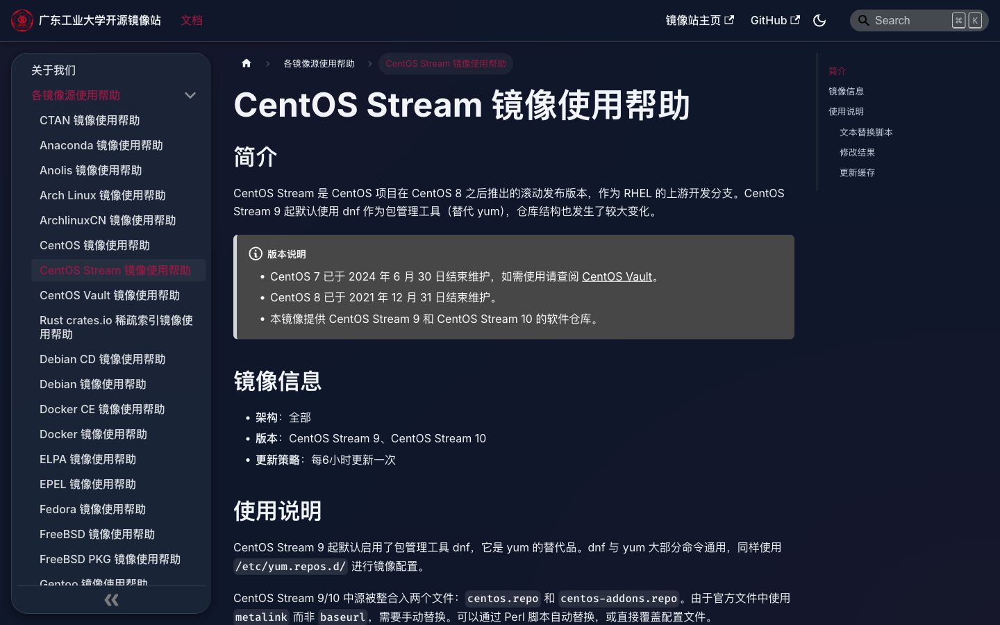
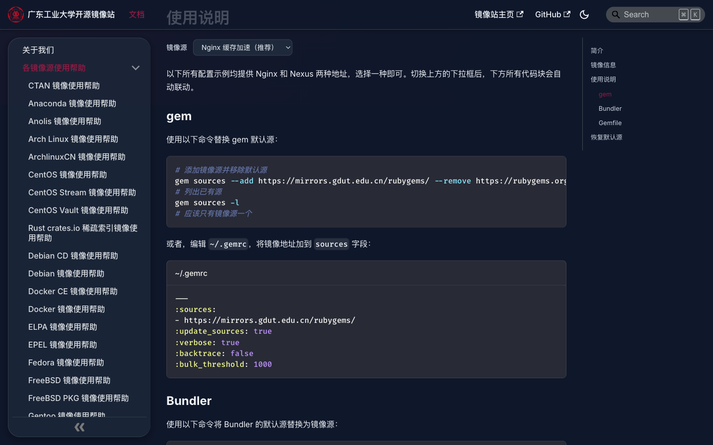
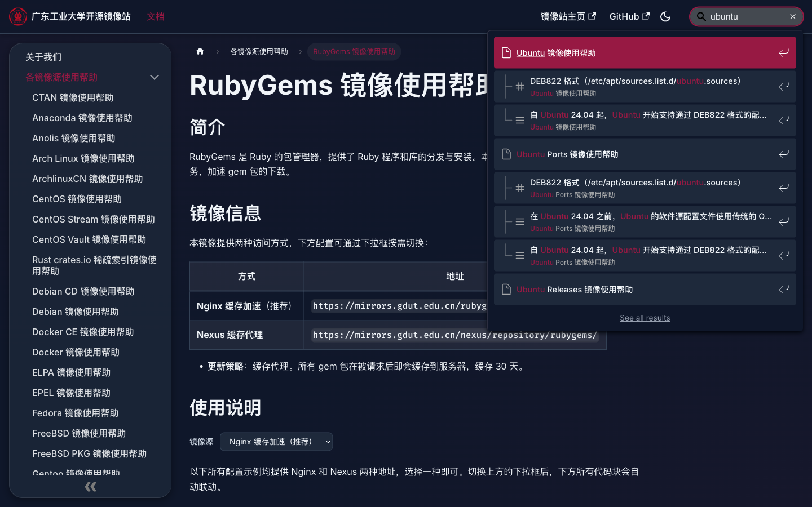
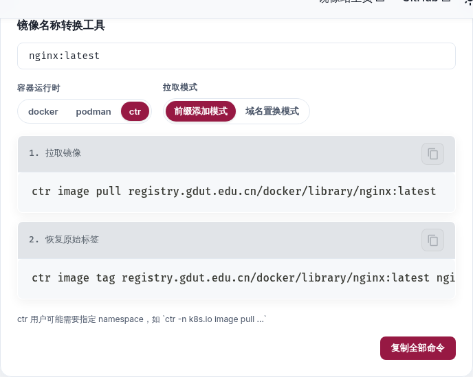
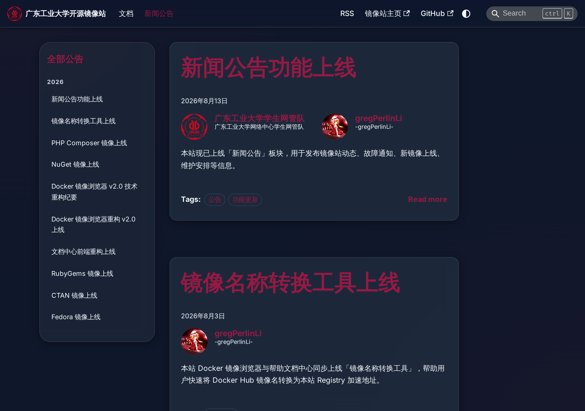

# 广东工业大学开源镜像站帮助文档

基于 [Docusaurus 3](https://docusaurus.io/) 构建的广东工业大学开源镜像站帮助文档站点，提供各镜像源的使用帮助与配置指南。

## 截图预览

<table>
  <tr>
    <td width="50%" align="center"><b>首页</b></td>
    <td width="50%" align="center"><b>文档页</b></td>
  </tr>
  <tr>
    <td></td>
    <td></td>
  </tr>
  <tr>
    <td width="50%" align="center"><b>MirrorSources 交互组件</b></td>
    <td width="50%" align="center"><b>代码块与语法高亮</b></td>
  </tr>
  <tr>
    <td></td>
    <td></td>
  </tr>
  <tr>
    <td width="50%" align="center"><b>MirrorSelector 下拉切换</b></td>
    <td width="50%" align="center"><b>本地搜索</b></td>
  </tr>
  <tr>
    <td></td>
    <td></td>
  </tr>
  <tr>
    <td width="50%" align="center"><b>ImageNameConverter 镜像名称转换工具</b></td>
    <td width="50%" align="center"><b>新闻公告</b></td>
  </tr>
  <tr>
    <td></td>
    <td></td>
  </tr>
</table>

## 功能特性

- **Island 设计风格 + Liquid Glass 特效**：整体视觉贴近[镜像站主页](https://mirrors.gdut.edu.cn)，采用毛玻璃卡片、渐变光效与圆角设计
- **MirrorSources 交互组件**：支持版本选择、HTTPS/源代码/安全源等开关切换，实时生成配置文件与快速配置命令，覆盖 APT（传统格式 / DEB822）、YUM、Pacman、Maven 五种镜像类型
- **ImageNameConverter 镜像名称转换工具**：输入 Docker 镜像名自动解析所属 Registry，生成本站加速拉取命令与恢复标签命令，支持 Docker/Podman/ctr 三种运行时与前缀添加/域名置换两种模式
- **MirrorSelector 下拉组件**：同一页面内多段代码块联动切换镜像源地址（如 Nginx 缓存加速 / Nexus 缓存代理）
- **PlatformIcon 组件**：在选项卡标签中渲染 Docker、Containerd、CRI-O、Podman、Windows、Linux 等平台图标
- **新闻公告**：基于 Docusaurus Blog 模块，路由 `/news`，支持文章置顶、侧边栏全量展示、RSS/Atom 订阅源
- **AI 智能搜索**：基于 `@easyops-cn/docusaurus-search-local` 的离线中英文全文搜索，集成 AI 问答助手（`mod+i` 唤起）
- **KaTeX 数学公式**：通过 remark-math + rehype-katex 支持行内与块级数学公式渲染
- **语法高亮**：基于 Prism，亮色模式使用 GitHub 主题，暗色模式使用 Dracula 主题；额外注册了 bash、ini、toml、properties、lisp、powershell、perl 语言；并扩展了 PowerShell 语法以识别 CLI 命令和参数
- **统一字体**：代码块统一使用 FiraCode NerdFont，字重 500；正文使用 Inter
- **暗色模式**：支持手动切换与跟随系统偏好
- **自动换行**：自定义代码块支持一键切换自动换行（与 Docusaurus 原生代码块一致）
- **40+ 镜像帮助文档**：涵盖 Ubuntu、Debian、CentOS Stream、Arch Linux、Fedora、Docker、PyPI、npm、RubyGems、Go、Maven、Composer、NuGet 等

## 技术栈

| 技术 | 说明 |
| --- | --- |
| [Docusaurus 3.10](https://docusaurus.io/) | 静态站点生成框架 |
| [@docusaurus/faster](https://docusaurus.io/docs/api/plugins/@docusaurus/faster) | 构建加速（Rspack） |
| [prism-react-renderer](https://github.com/FormidableLabs/prism-react-renderer) | 代码语法高亮 |
| [@easyops-cn/docusaurus-search-local](https://github.com/easyops-cn/docusaurus-search-local) | 离线本地搜索 + AI 问答 |
| [KaTeX](https://katex.org/) | 数学公式渲染（remark-math + rehype-katex） |
| React 19 | 前端框架 |
| TypeScript | 类型安全 |
| Infima | Docusaurus 默认 CSS 框架 |

## 项目结构

```
mirrors-docs/
├── blog/                          # 新闻公告（MDX）
│   ├── 2026-05-14-fedora-mirror-launched.mdx
│   ├── ...
│   ├── authors.yml                # 作者定义
│   └── tags.yml                   # 标签定义
├── docs/                          # 镜像帮助文档（Markdown / MDX）
│   ├── intro.md                   # 关于我们
│   └── mirrors/                   # 各镜像源使用帮助
│       ├── ubuntu-help.mdx        # Ubuntu（含 MirrorSources 组件）
│       ├── docker-help.mdx        # Docker（含 ImageNameConverter 组件）
│       ├── rubygems-help.mdx      # RubyGems（含 MirrorSelector 组件）
│       └── ...                    # 更多镜像帮助文档
├── src/
│   ├── components/
│   │   ├── MirrorSources/         # 交互式镜像配置生成组件
│   │   │   ├── index.tsx          # 主组件（版本选择、开关、代码高亮）
│   │   │   ├── generators.ts      # 配置文件内容生成器
│   │   │   ├── types.ts           # 类型定义
│   │   │   └── styles.module.css  # 组件样式
│   │   ├── ImageNameConverter/    # Docker 镜像名称转换工具组件
│   │   │   ├── index.tsx          # 主组件（输入框、分段滑块、命令生成）
│   │   │   ├── registries.ts      # Registry 配置数据与解析函数
│   │   │   └── styles.module.css  # 组件样式
│   │   ├── MirrorSelector/        # 下拉镜像源切换组件
│   │   │   ├── index.tsx          # MirrorSelector + MirrorContent
│   │   │   └── styles.module.css  # 组件样式
│   │   └── PlatformIcon/          # 平台图标组件（选项卡标签用）
│   │       └── index.tsx
│   ├── css/
│   │   └── custom.css             # 全局自定义样式（主题色、毛玻璃、语法高亮等）
│   ├── pages/
│   │   └── index.tsx              # 首页
│   └── theme/
│       └── prism-include-languages/
│           └── index.ts           # Prism 语言扩展（PowerShell CLI 增强）
├── static/
│   ├── font/                      # 字体文件（FiraCode NerdFont / MyriadPro / SFMono）
│   └── img/                       # Logo、图标、社交卡片等静态图片
├── screenshots/                   # README 截图
├── docusaurus.config.ts           # Docusaurus 配置
├── sidebars.ts                    # 侧边栏配置
└── package.json
```

## 快速开始

### 环境要求

- Node.js >= 18
- npm 或 yarn

### 安装依赖

```bash
npm install
```

### 本地开发

```bash
npm start
```

启动开发服务器后，浏览器访问 `http://localhost:3000/help/`，修改内容会实时热更新。

### 生产构建

```bash
npm run build
```

构建产物输出到 `build/` 目录，可使用任意静态文件服务器部署。

### 本地预览构建产物

```bash
npm run serve
```

### 类型检查

```bash
npm run typecheck
```

## 部署

站点部署于 `https://mirrors.gdut.edu.cn/help/`，`baseUrl` 配置为 `/help`。

通过 GitLab CI/CD 自动构建部署，详见仓库 `.gitlab-ci.yml`。

## 编写文档

### 普通文档

在 `docs/mirrors/` 目录下创建 `.md` 或 `.mdx` 文件，文件头部添加 frontmatter：

```markdown
---
sidebar_position: 1
---

# 镜像名称 镜像使用帮助

## 简介

...

## 使用说明

...
```

需要使用 React 组件（MirrorSources、MirrorSelector、ImageNameConverter、Tabs 等）时，文件扩展名必须为 `.mdx`。

### 使用 MirrorSources 组件

在 `.mdx` 文件中引入组件，支持 `apt-traditional`、`apt-deb822`、`yum`、`pacman`、`maven` 五种类型：

```mdx
import MirrorSources from '@site/src/components/MirrorSources';

<MirrorSources
  type="apt-traditional"
  host="mirrors.gdut.edu.cn"
  path="/ubuntu"
  versions={[
    { label: '24.04 LTS (noble)', codename: 'noble' },
    { label: '22.04 LTS (jammy)', codename: 'jammy' },
  ]}
  components={['main', 'restricted', 'universe', 'multiverse']}
  filePath="/etc/apt/sources.list"
  options={{ https: true, source: true, proposed: true, security: true }}
/>
```

### 使用 MirrorSelector 组件

在 `.mdx` 文件中引入组件，实现下拉框联动切换镜像源地址：

```mdx
import {MirrorSelector, MirrorContent} from '@site/src/components/MirrorSelector';

<MirrorSelector>

<MirrorContent type="nginx">

```bash
gem sources --add https://mirrors.gdut.edu.cn/rubygems/ --remove https://rubygems.org/
```

</MirrorContent>

<MirrorContent type="nexus">

```bash
gem sources --add https://repo.gdut.edu.cn/repository/rubygems/ --remove https://rubygems.org/
```

</MirrorContent>

</MirrorSelector>
```

### 编写新闻公告

在 `blog/` 目录下创建 `.mdx` 文件，文件命名格式为 `YYYY-MM-DD-slug.mdx`，头部添加 frontmatter：

```yaml
---
slug: mirror-launched
title: 镜像上线
authors: [gdutnic, gregPerlinLi]
tags: [新镜像上线]
date: 2026-07-31
---
```

作者与标签定义见 `blog/authors.yml` 和 `blog/tags.yml`。在正文简介后使用 `{/* truncate */}` 标记摘要截断点。支持 `pin: true` frontmatter 字段将公告置顶。

## 相关链接

- [镜像站主页](https://mirrors.gdut.edu.cn)
- [文档中心源码](https://github.com/gdut-network-manager/mirrors-gdut-docs)
- [镜像站源码](https://github.com/chn-lee-yumi/mirrors-gdut)
- [广东工业大学](https://www.gdut.edu.cn/)
- [网络中心](https://nic.gdut.edu.cn/)
- [Docusaurus 文档](https://docusaurus.io/docs)

## 许可证

本项目基于 [MIT](LICENSE) 协议开源。

版权所有 © 2026 广东工业大学网管队
